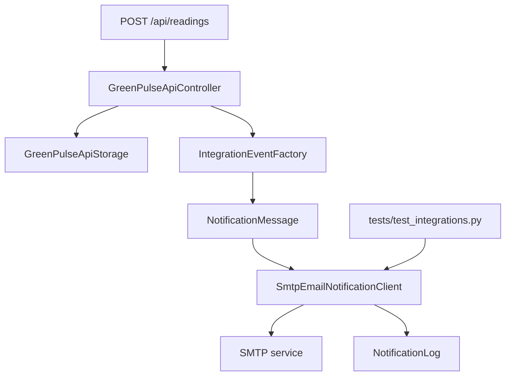

# GreenPulse — интеграция с внешним сервисом

## Практическая работа №30

Документ описывает интеграцию проекта GreenPulse с внешним сервисом email-уведомлений через SMTP.

По условию практической работы необходимо подключить внешний сервис, реализовать обмен данными через API или SDK и протестировать взаимодействие. Для GreenPulse выбран вариант SMTP/email-уведомлений: при создании новой записи экологического измерения система формирует уведомление оператору.

## 1. Выбранный внешний сервис

Выбран сервис:

```text
SMTP / email-уведомления
```

Причины выбора:

- email-уведомления подходят для операторов мониторинга;
- интеграция не требует сложного пользовательского интерфейса;
- SMTP можно протестировать автоматически с помощью fake SMTP-клиента;
- секреты SMTP можно хранить во внешних переменных окружения, не помещая их в репозиторий.

## 2. Сценарий интеграции

Основной сценарий:

```text
При создании новой записи экологического измерения через API GreenPulse отправляет email-уведомление оператору.
```

Пример события:

```text
Создана новая запись экологического мониторинга.
ID записи: REC-INTEGRATION-001
Станция: MSK-001
Район: ЦАО
Тип датчика: pm25
Значение: 18.4
```

## 3. Архитектура интеграции



## 4. Реализованные компоненты

### 4.1. Файл `src/integrations.py`

В проект добавлен модуль интеграций.

| Компонент | Назначение |
|---|---|
| `NotificationMessage` | DTO уведомления: event_id, subject, body |
| `IntegrationResult` | Результат отправки уведомления |
| `NotificationClient` | Протокол клиента уведомлений |
| `NotificationLog` | Хранит уже отправленные события и предотвращает дублирование |
| `SmtpEmailNotificationClient` | Клиент отправки email через SMTP |
| `IntegrationEventFactory` | Формирует уведомления по событиям GreenPulse |
| `build_smtp_client_from_environment` | Создает SMTP-клиент из переменных окружения |

### 4.2. Изменение `src/api.py`

В API добавлена поддержка уведомлений.

При успешном вызове:

```http
POST /api/readings
```

контроллер:

1. Проверяет API-ключ.
2. Валидирует JSON payload.
3. Создает запись измерения.
4. Сохраняет запись в storage.
5. Формирует событие `reading-created`.
6. Передает событие в SMTP notification client.
7. Возвращает результат создания и статус уведомления.

## 5. Конфигурация SMTP

Для production-сценария настройки SMTP берутся из переменных окружения.

| Переменная | Назначение |
|---|---|
| `GREENPULSE_SMTP_HOST` | SMTP host |
| `GREENPULSE_SMTP_PORT` | SMTP port, по умолчанию 587 |
| `GREENPULSE_SMTP_USERNAME` | SMTP login |
| `GREENPULSE_SMTP_PASSWORD` | SMTP password |
| `GREENPULSE_SMTP_TLS` | Использовать TLS, по умолчанию true |
| `GREENPULSE_NOTIFY_FROM` | Адрес отправителя |
| `GREENPULSE_NOTIFY_TO` | Адрес получателя |

Секреты не должны храниться в коде или репозитории.

## 6. Пример запуска с переменными окружения

### PowerShell

```powershell
$env:GREENPULSE_SMTP_HOST = "smtp.example.com"
$env:GREENPULSE_SMTP_PORT = "587"
$env:GREENPULSE_SMTP_USERNAME = "greenpulse@example.com"
$env:GREENPULSE_SMTP_PASSWORD = "secret-password"
$env:GREENPULSE_NOTIFY_FROM = "greenpulse@example.com"
$env:GREENPULSE_NOTIFY_TO = "operator@example.com"
python -m src.api
```

### Bash

```bash
export GREENPULSE_SMTP_HOST="smtp.example.com"
export GREENPULSE_SMTP_PORT="587"
export GREENPULSE_SMTP_USERNAME="greenpulse@example.com"
export GREENPULSE_SMTP_PASSWORD="secret-password"
export GREENPULSE_NOTIFY_FROM="greenpulse@example.com"
export GREENPULSE_NOTIFY_TO="operator@example.com"
python -m src.api
```

## 7. Пример API-запроса

```bash
curl -X POST http://127.0.0.1:8000/api/readings \
  -H "Content-Type: application/json" \
  -H "X-API-Key: greenpulse-demo-key" \
  -d '{
    "record_id": "REC-INTEGRATION-001",
    "station_id": "MSK-001",
    "district": "ЦАО",
    "sensor_type": "pm25",
    "value": 18.4
  }'
```

Пример ответа:

```json
{
  "message": "reading created",
  "reading": {
    "record_id": "REC-INTEGRATION-001",
    "station_id": "MSK-001",
    "district": "ЦАО",
    "sensor_type": "pm25",
    "value": 18.4,
    "measured_at": "2026-05-25T12:00:00"
  },
  "notification": {
    "provider": "smtp",
    "sent": true,
    "skipped": false,
    "detail": "email notification sent"
  }
}
```

## 8. Обработка ошибок

| Ситуация | Поведение |
|---|---|
| SMTP не настроен | Уведомление не отправляется, API продолжает работать |
| Ошибка SMTP-сервера | Ошибка логируется, в ответе возвращается `smtp error` |
| Повторное событие | Отправка пропускается, чтобы избежать дублирования |
| Некорректный API payload | Запись не создается, уведомление не отправляется |
| Неверный API-ключ | Возвращается `401`, уведомление не отправляется |

## 9. Защита от дублирования

Для защиты от повторных уведомлений используется `NotificationLog`.

Каждому уведомлению назначается `event_id`:

```text
reading-created:<record_id>
```

Если событие с таким `event_id` уже отправлялось, повторная отправка пропускается.

## 10. Тестирование интеграции

Добавлен файл:

```text
tests/test_integrations.py
```

Тесты проверяют:

- успешную отправку email через fake SMTP client;
- запуск TLS;
- авторизацию SMTP;
- отсутствие дублей при повторной отправке события;
- обработку ошибки SMTP;
- вызов уведомления после создания записи через API.

Запуск:

```bash
PYTHONPATH=. python -m tests.test_integrations
```

## 11. CI/CD

Добавлен workflow:

```text
.github/workflows/integration_tests.yml
```

Он запускает интеграционные тесты при push, pull request и вручную через GitHub Actions.

## 12. Файлы, добавленные или измененные в рамках ПЗ30

| Файл | Назначение |
|---|---|
| `src/integrations.py` | SMTP-интеграция уведомлений |
| `src/api.py` | Вызов уведомления при создании записи |
| `tests/test_integrations.py` | Автоматические тесты интеграции |
| `.github/workflows/integration_tests.yml` | Workflow тестирования интеграции |
| `docs/integration/EXTERNAL_SERVICE_INTEGRATION_GreenPulse.md` | Документация по внешней интеграции |

## 13. Итог

В проект GreenPulse добавлена интеграция с внешним сервисом email-уведомлений через SMTP. Обмен данными происходит при создании новой записи экологического измерения через REST API. Интеграция покрыта тестами, обрабатывает ошибки и предотвращает дублирование уведомлений.

## 14. Ссылки

- Репозиторий: https://github.com/andreyobloff/grpulse
- Документация интеграции: https://github.com/andreyobloff/grpulse/blob/main/docs/integration/EXTERNAL_SERVICE_INTEGRATION_GreenPulse.md
- Код интеграции: https://github.com/andreyobloff/grpulse/blob/main/src/integrations.py
- Тесты интеграции: https://github.com/andreyobloff/grpulse/blob/main/tests/test_integrations.py
- GitHub Actions: https://github.com/andreyobloff/grpulse/actions
