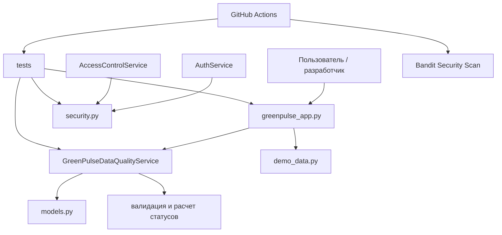
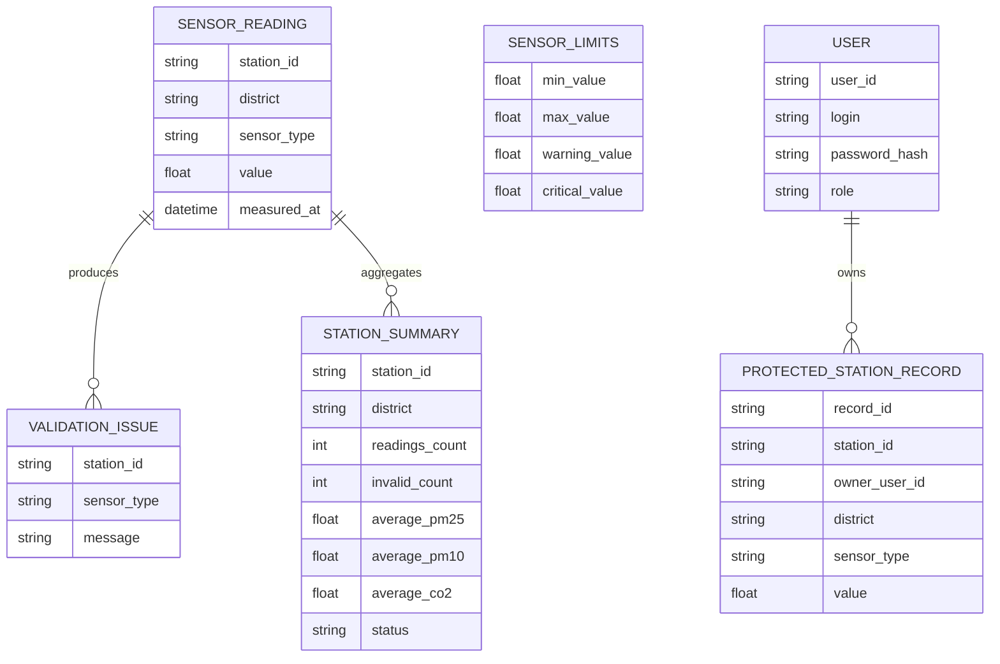

# GreenPulse — техническая документация

## Практическая работа №28

Документ предназначен для разработчиков и описывает внутреннее устройство проекта GreenPulse: архитектуру, основные компоненты, модели данных, ключевые проектные решения, обработку ошибок и используемые технологии.

GreenPulse — учебный прототип системы городского мониторинга экологической среды. Проект реализует обработку данных экологических датчиков, валидацию измерений, расчет статусов качества среды, формирование отчетов по станциям, базовые механизмы безопасности и CI/CD-проверки.

## 1. Общая архитектура проекта

Проект построен как модульное Python-приложение с разделением ответственности между слоями.



### 1.1. Архитектурный стиль

Используется упрощенная слоистая архитектура:

| Слой | Назначение | Основные файлы |
|---|---|---|
| Entry point | Запуск приложения и вывод отчета | `src/greenpulse_app.py` |
| Business logic | Валидация данных, расчет статусов, отчеты | `src/services.py` |
| Domain model | Доменные модели и перечисления | `src/models.py` |
| Demo data | Источник демонстрационных данных | `src/demo_data.py` |
| Security | Аутентификация, хеширование паролей, контроль доступа | `src/security.py` |
| Tests | Проверка бизнес-логики и безопасности | `tests/` |
| CI/CD | Автоматические проверки и сборка | `.github/workflows/` |
| Documentation | Пользовательская, техническая и проектная документация | `docs/` |

### 1.2. Ключевые проектные решения

- Код разделен на модули после рефакторинга.
- Доменные сущности описаны через `dataclass`.
- Статусы качества среды заданы через `Enum`.
- Валидация данных выполняется до расчета агрегатов.
- Некорректные данные исключаются из расчетов.
- Пароли не хранятся в открытом виде.
- Доступ к данным ограничивается по владельцу записи.
- Проверки качества и безопасности запускаются через GitHub Actions.

## 2. Структура каталогов

```text
.
├── src/
│   ├── __init__.py
│   ├── greenpulse_app.py
│   ├── models.py
│   ├── services.py
│   ├── demo_data.py
│   └── security.py
├── tests/
│   ├── __init__.py
│   ├── test_greenpulse.py
│   └── test_security.py
├── docs/
│   ├── agile/
│   ├── risk/
│   ├── security/
│   ├── technical/
│   └── user/
├── .github/
│   └── workflows/
├── CHANGELOG.md
├── VERSION.txt
└── README.md
```

## 3. Компоненты приложения

### 3.1. Модуль `models.py`

Модуль содержит доменные структуры данных.

| Класс / Enum | Назначение |
|---|---|
| `QualityStatus` | Перечисление статусов `normal`, `warning`, `critical`, `invalid` |
| `SensorLimits` | Ограничения для типа датчика: min/max/warning/critical |
| `SensorReading` | Одно измерение от станции мониторинга |
| `ValidationIssue` | Ошибка или предупреждение валидации |
| `StationSummary` | Сводный отчет по станции |

### 3.2. Модуль `services.py`

Главный сервис бизнес-логики — `GreenPulseDataQualityService`.

Основные обязанности:

- хранение допустимых диапазонов датчиков;
- проверка одного измерения;
- пакетная валидация данных;
- расчет статуса по одному измерению;
- расчет сводки по станции;
- расчет общего городского статуса;
- формирование отчета по всем станциям.

Основные методы:

| Метод | Назначение |
|---|---|
| `validate_reading` | Проверяет одно измерение |
| `validate_batch` | Возвращает список ошибок по набору измерений |
| `detect_status` | Определяет статус по типу датчика и значению |
| `calculate_station_summary` | Формирует сводку по станции |
| `calculate_city_status` | Возвращает общий статус по городу |
| `build_station_report` | Формирует список отчетов по станциям |

### 3.3. Модуль `demo_data.py`

Модуль содержит функцию `load_demo_readings`, которая возвращает тестовый набор измерений.

Используется для:

- демонстрации работы приложения;
- проверки валидации;
- тестирования статусов;
- запуска CI/CD без подключения реальной базы данных.

### 3.4. Модуль `greenpulse_app.py`

Точка входа приложения.

Основные функции:

- загрузка демонстрационных данных;
- запуск сервиса обработки данных;
- вывод общего статуса города;
- вывод количества ошибок;
- вывод отчета по станциям;
- вывод найденных проблем валидации.

Запуск:

```bash
python -m src.greenpulse_app
```

### 3.5. Модуль `security.py`

Модуль отвечает за базовые механизмы безопасности.

| Компонент | Назначение |
|---|---|
| `PasswordHasher` | Хеширование и проверка паролей |
| `AuthService` | Регистрация и аутентификация пользователей |
| `AccessControlService` | Контроль доступа к защищенным записям |
| `User` | Пользователь системы |
| `ProtectedStationRecord` | Запись станции с владельцем |
| `AuthenticationError` | Ошибка аутентификации |
| `AccessDeniedError` | Ошибка доступа со статусом 403 |

Пароли хешируются с использованием PBKDF2-HMAC-SHA256 с солью.

## 4. Работа с данными

### 4.1. Основная модель данных



### 4.2. Описание таблиц для будущей базы данных

В текущей версии проекта реальная база данных не подключена, но логическая модель может быть перенесена в БД.

#### Таблица `users`

| Поле | Тип | Описание |
|---|---|---|
| `user_id` | string | Уникальный идентификатор пользователя |
| `login` | string | Логин пользователя |
| `password_hash` | string | Хеш пароля |
| `role` | string | Роль: `operator` или `admin` |

#### Таблица `sensor_readings`

| Поле | Тип | Описание |
|---|---|---|
| `station_id` | string | Идентификатор станции |
| `district` | string | Район города |
| `sensor_type` | string | Тип датчика |
| `value` | float | Измеренное значение |
| `measured_at` | datetime | Дата и время измерения |

#### Таблица `validation_issues`

| Поле | Тип | Описание |
|---|---|---|
| `station_id` | string | Станция, где найдена ошибка |
| `sensor_type` | string | Тип датчика |
| `message` | string | Описание ошибки |

#### Таблица `station_summaries`

| Поле | Тип | Описание |
|---|---|---|
| `station_id` | string | Идентификатор станции |
| `district` | string | Район |
| `readings_count` | int | Количество измерений |
| `invalid_count` | int | Количество ошибок |
| `average_pm25` | float | Среднее значение PM2.5 |
| `average_pm10` | float | Среднее значение PM10 |
| `average_co2` | float | Среднее значение CO2 |
| `status` | string | Итоговый статус станции |

## 5. Форматы данных

### 5.1. Пример входного JSON для измерения

```json
{
  "station_id": "MSK-001",
  "district": "ЦАО",
  "sensor_type": "pm25",
  "value": 18.4,
  "measured_at": "2026-05-25T12:00:00"
}
```

### 5.2. Пример JSON для отчета по станции

```json
{
  "station_id": "MSK-001",
  "district": "ЦАО",
  "readings_count": 3,
  "invalid_count": 0,
  "average_pm25": 18.4,
  "average_pm10": 42.7,
  "average_co2": 820.0,
  "status": "normal"
}
```

### 5.3. Пример JSON для защищенной записи

```json
{
  "record_id": "REC-001",
  "station_id": "MSK-001",
  "owner_user_id": "USR-001",
  "district": "ЦАО",
  "sensor_type": "pm25",
  "value": 18.4
}
```

## 6. API-контракты для будущей реализации

В текущем прототипе HTTP API не реализован, но ниже зафиксированы рекомендуемые контракты.

### 6.1. Получение списка станций

```http
GET /api/v1/stations
Authorization: Bearer <token>
```

Ответ:

```json
{
  "stations": ["MSK-001", "MSK-002", "MSK-003"]
}
```

### 6.2. Получение отчета по станции

```http
GET /api/v1/stations/MSK-001/summary
Authorization: Bearer <token>
```

Ответ:

```json
{
  "station_id": "MSK-001",
  "district": "ЦАО",
  "status": "normal",
  "readings_count": 3,
  "invalid_count": 0
}
```

### 6.3. Получение защищенной записи

```http
GET /api/v1/records/REC-001
Authorization: Bearer <token>
```

Возможные ответы:

| Код | Описание |
|---|---|
| `200` | Запись успешно получена |
| `403` | Пользователь не имеет доступа к записи |
| `404` | Запись не найдена |

## 7. Валидация и обработка ошибок

### 7.1. Валидация измерений

Метод `validate_reading` проверяет:

- `station_id` не пустой;
- `district` не пустой;
- `sensor_type` входит в список поддерживаемых датчиков;
- `value` не ниже минимального допустимого значения;
- `value` не выше максимального допустимого значения.

### 7.2. Типовые ошибки валидации

| Сообщение | Причина | Обработка |
|---|---|---|
| `Station id is empty` | Пустой идентификатор станции | Запись считается невалидной |
| `District is empty` | Не указан район | Запись считается невалидной |
| `Unknown sensor type` | Тип датчика отсутствует в конфигурации | Запись исключается из расчетов |
| `Value is below allowed range` | Значение ниже допустимого диапазона | Запись исключается из расчетов |
| `Value is above allowed range` | Значение выше допустимого диапазона | Запись исключается из расчетов |

### 7.3. Ошибки безопасности

| Ошибка | Причина | Обработка |
|---|---|---|
| `AuthenticationError` | Неверный логин, пароль или некорректные учетные данные | Пользователь не проходит вход |
| `AccessDeniedError` | Попытка получить чужую запись | Возвращается логический статус `403` |
| `ValueError` | Запись не найдена | В будущем API должна преобразовываться в `404` |

## 8. CI/CD и качество кода

В проекте используются GitHub Actions.

| Workflow | Назначение |
|---|---|
| `build.yml` | Проверка структуры проекта, запуск приложения и тестов |
| `test.yml` | Автоматический запуск тестов |
| `deploy.yml` | Подготовка deployment artifact |
| `security.yml` | Статический анализ безопасности Bandit |
| `security_measures.yml` | Проверка реализованных мер безопасности |

## 9. Тестирование

### 9.1. Запуск бизнес-тестов

```bash
python -m tests.test_greenpulse
```

### 9.2. Запуск security-тестов

```bash
python -m tests.test_security
```

Проверяются:

- расчет статуса среды;
- обнаружение невалидных измерений;
- формирование отчета по станции;
- хеширование паролей;
- вход по корректному паролю;
- отказ при неверном пароле;
- запрет доступа к чужим данным;
- доступ администратора ко всем данным.

## 10. Используемые технологии и библиотеки

| Технология | Назначение |
|---|---|
| Python 3.11 | Основной язык разработки |
| dataclasses | Описание доменных моделей |
| Enum | Описание статусов качества среды |
| hashlib.pbkdf2_hmac | Хеширование паролей |
| hmac.compare_digest | Безопасное сравнение хешей |
| Git | Контроль версий |
| GitHub | Хранение репозитория |
| GitHub Actions | CI/CD и автоматические проверки |
| Flake8 | Статический анализ стиля кода |
| Bandit | Статический анализ безопасности |

## 11. Правила развития проекта

- Новая бизнес-логика добавляется в `services.py` или отдельный сервисный модуль.
- Новые доменные сущности добавляются в `models.py`.
- Новые security-механизмы добавляются в `security.py`.
- Для каждой новой функции необходимо добавить тест.
- Изменения должны проходить GitHub Actions.
- Документация должна обновляться вместе с изменением поведения системы.
- Для изменений данных и API необходимо обновлять техническую документацию.

## 12. Known limitations

| Ограничение | Комментарий |
|---|---|
| Нет реальной базы данных | Используются демонстрационные данные |
| Нет HTTP API | Контракты описаны как будущая реализация |
| Нет полноценной системы пользователей | Реализован учебный in-memory AuthService |
| Нет production deployment | Используется deployment artifact через GitHub Actions |
| Нет UI | Работа демонстрируется через консоль и документацию |

## 13. Ссылки

- Репозиторий: https://github.com/andreyobloff/grpulse
- Пользовательская документация: https://github.com/andreyobloff/grpulse/blob/main/docs/user/USER_GUIDE_GreenPulse.md
- Техническая документация: https://github.com/andreyobloff/grpulse/blob/main/docs/technical/TECHNICAL_DOCUMENTATION_GreenPulse.md
- GitHub Actions: https://github.com/andreyobloff/grpulse/actions
